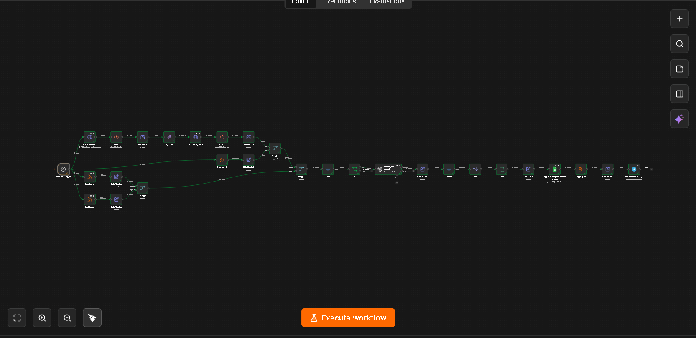
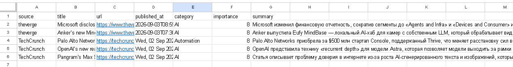
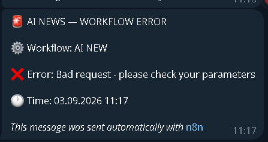

# AI News Intelligence Automation with n8n

An automated AI-powered news intelligence workflow built with **n8n**
that collects technology and AI news from multiple sources, filters
recent and relevant articles, analyzes them with an OpenAI model, ranks
the most important stories, stores structured results in Google Sheets,
and sends a daily Top 5 digest to Telegram.

## Overview

The workflow automates a daily editorial research pipeline:

1.  Collect articles from multiple sources.
2.  Normalize different source formats.
3.  Keep articles from the last 24 hours.
4.  Pre-filter AI/technology topics.
5.  Use an OpenAI model to classify, score, and summarize candidates.
6.  Keep articles with importance \>= 7/10.
7.  Sort and select the Top 5.
8.  Append or update Google Sheets rows using the article URL as the
    matching key.
9.  Send one formatted Telegram digest.

## Architecture

``` text
Schedule Trigger
   ├── Anthropic News → HTTP Request → HTML parsing
   ├── TechCrunch → RSS
   ├── The Verge → RSS
   └── OpenAI News → RSS
            ↓
     Normalize source data
            ↓
        Merge streams
            ↓
      Last 24h filter
            ↓
    AI keyword pre-filter
            ↓
      OpenAI analysis
            ↓
  Parse structured AI output
            ↓
 Importance filter (>= 7)
            ↓
    Sort by importance
            ↓
        Limit Top 5
            ↓
 Google Sheets Append/Update
            ↓
         Aggregate
            ↓
    Build Telegram digest
            ↓
          Telegram
```
## Workflow Overview



## Results

### Daily Telegram AI News Digest


### Google Sheets News Database



### Error Handling

The workflow includes a separate error-handling workflow that sends an immediate Telegram notification when a production execution fails.



A separate n8n Error Workflow sends a Telegram alert if the production
workflow fails.

## AI Analysis

Each candidate is analyzed into structured JSON:

``` json
{
  "relevant": true,
  "category": "AI",
  "importance": 8,
  "summary": "Short summary of the news in Russian"
}
```

Categories: `AI`, `Automation`, `AI Agents`, `LLM`, `Technology`,
`Other`.

## Data Schema

  Field            Description
  ---------------- ------------------------------------
  `source`         News source
  `title`          Article title
  `url`            Original article URL
  `published_at`   Publication date/time
  `category`       AI-generated category
  `importance`     Importance score from 1 to 10
  `summary`        Short AI-generated Russian summary

## Sources

The current workflow collects content from **Anthropic News, TechCrunch,
The Verge, and OpenAI News**. Anthropic is processed through HTTP
requests and HTML extraction; the other configured sources use RSS
feeds.

## Google Sheets Storage

The Google Sheets node uses **Append or Update Row** with `url` as the
matching column. This prevents multiple database rows for the same
article URL and allows an existing row to be updated.

> Storage-level URL deduplication does not guarantee that the same story
> can never appear in a later Telegram digest. Strict delivery
> deduplication can be added with a sent-state check.

## Telegram Digest

The Top 5 results are aggregated into one message containing the title,
source, category, importance score, Russian summary, and original URL.

``` text
🤖 AI NEWS — TOP 5

1. Article title

📡 Source | 🏷️ Category | ⭐ 9/10

📝 Short AI-generated summary

🔗 Article URL
```

## Reliability

Production-oriented features include scheduled execution, retries for
external integrations, a separate n8n Error Workflow, and Telegram error
notifications. The error-notification path was tested by intentionally
causing a Telegram delivery failure.

## Schedule

The production schedule is once per day at **09:00, Europe/Warsaw**.

## Tech Stack

-   **n8n** --- orchestration
-   **OpenAI** --- classification, scoring, summarization
-   **RSS** --- news ingestion
-   **HTTP Request + HTML parsing** --- Anthropic content extraction
-   **Google Sheets** --- structured storage
-   **Telegram Bot API** --- digest and error notifications

## Repository Structure

``` text
ai-news-intelligence-n8n/
├── README.md
├── workflow/
│   └── AI_NEW_SANITIZED.json
├── screenshots/
│   ├── workflow-overview.png
│   ├── telegram-digest.png
│   ├── google-sheets.png
│   └── error-handler.png
└── docs/
    └── case-study.pdf
```

## Setup

### 1. Import the workflow

Import `workflow/AI_NEW_SANITIZED.json` into n8n.

### 2. Configure credentials

Reconnect your own OpenAI, Google Sheets, and Telegram credentials. No
API keys are included in the public workflow.

### 3. Configure Google Sheets

Create these columns:

``` text
source
title
url
published_at
category
importance
summary
```

Select your spreadsheet in the Google Sheets node and use `url` as the
matching column.

### 4. Configure Telegram

Connect your Telegram bot and replace:

``` text
__TELEGRAM_CHAT_ID__
```

with your destination chat ID.

### 5. Configure the Error Workflow

Create a separate workflow:

``` text
Error Trigger → Telegram
```

Select it as the Error Workflow in the main workflow settings.

### 6. Test and activate

Run the workflow manually, verify source collection, AI output, Google
Sheets mapping, and Telegram formatting, then activate/publish it.

## Security

The repository workflow is a sanitized export. Credential references,
Telegram chat ID, Google Sheet ID, private workflow/instance
identifiers, and webhook-specific identifiers have been removed.

Always review n8n exports before publishing them publicly.

## Possible Improvements

-   Strict already-sent detection before Telegram delivery
-   PostgreSQL/Supabase storage
-   Semantic duplicate detection across different URLs
-   Additional news sources
-   Configurable categories and scoring
-   Slack, Discord, or email delivery
-   Weekly analytics and trend reports

## Use Cases

This architecture can be adapted for AI/technology monitoring, editorial
research, competitor monitoring, market intelligence, industry news
aggregation, and internal company briefings.

## Project Status

**Production-ready portfolio project / working MVP**

Tested end-to-end with scheduled execution, AI processing, Google Sheets
storage, Telegram delivery, retries, and global error notification.

## Author

Built as an **AI Automation / n8n portfolio project**.
